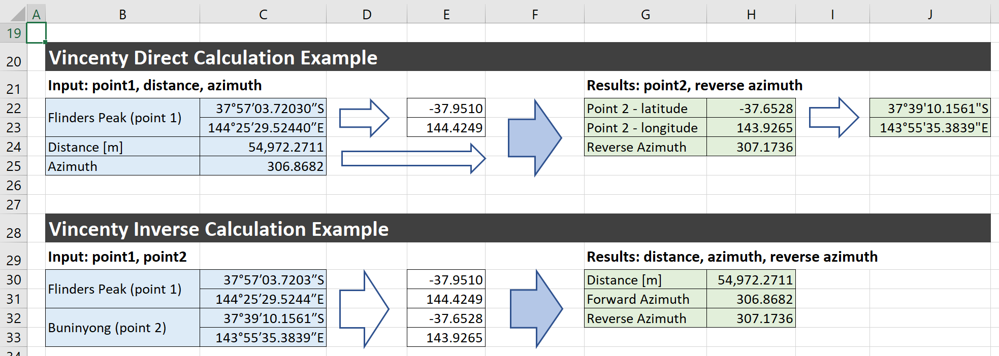

# Vincenty's Direct and Inverse Solution of Geodesics on the Ellipsoid - Excel VBA implementation
**to calculate new coordinate based on azimuth and distance (direct)  
or distance and azimuth based on two coordinates (inverse)**
> **Algorithms by Thaddeus Vincenty (1975)**  
> Based on the implementation in Java Script by Chris Veness  
> https://www.movable-type.co.uk/scripts/latlong-vincenty.html  
> https://github.com/chrisveness/geodesy

To make the long story short, I was looking for a way to calculate coordinates, distance and azimuth in Excel.
I checked out several available solutions but they were either incomplete, did not work or results were inaccurate.
That is how I ended up developing my own, complete Vincenty's Direct and Inverse formulae implementation.

## How to use it?
+ Vincenty functions can be simply added to any existing Excel workbook. Download [Vincenty.bas](../../raw/master/Vincenty.bas) file, in Excel hit [Alt+F11] to open Visual Basic editor. Next, in the browser panel right-click on **VBA Project (your file name)**, select **Import File** and choose downloaded [Vincenty.bas](../../raw/master/Vincenty.bas) module. Then save as 'macro-enabled workbook" and you will be able to use added functions in your Excel formulas. In a cell just start typing: `=Vincenty..` and you should see the list of added functions. Do NOT simply copy-paste file text content to a new Excel module - file contains some extra lines not visible in VBA editor.
+ Functions and their parameters are listed in Excel function wizard under the **Geodesic** category.
+ If you prefer to use Excel Add-in instead you can simply save workbook as Add-in. Note that Add-in file must be placed in a directory registered as "Trusted Location". See [Add, remove, or change a trusted location](https://support.office.com/en-us/article/add-remove-or-change-a-trusted-location-7ee1cdc2-483e-4cbb-bcb3-4e7c67147fb4) for more details. There is no IntelliSense available for VBA Add-in UDFs. Add-in, however, has one important advantage: it can be shared among many Excel workbooks, simplifying future updates.

## Excel files
+ [Vincenty.xlsm](../../raw/master/Vincenty.xlsm) - Excel Macro-Enabled Demo Workbook (demo)
+ [Vincenty.xls](../../raw/master/Vincenty.xls) - Excel 97-2003 Demo Workbook
+ [Vincenty.bas](../../raw/master/Vincenty.bas) - VBA module source code - can be simply added to any existing workbook
+ [PL2000.bas](../../raw/master/PL2000.bas) - VBA module source code - contains functions to translate WGS84 coordinates to/from the Polish geodetic coordinate system (PL-2000), based on the Gauss-Krüger coordinate system.

## Implementation
Solution contains 6 functions implementing **Vincenty's Direct** and **Vincenty's Inverse** formulae as well as 2 functions for Decimal&nbsp;↔&nbsp;Degrees/Minutes/Seconds format conversion, and uses **WGS84** model.  
> Most function arguments and return values are 64-bit high precision. In VBA `Double` data type denotes 64-bit floating-point number, regardless of whether 32 or 64 bit Excel edition is used.

+ `VincentyDirLat(lat as Double, lon as Double, azimuth as Double, distance as Double) as Variant` 
Calculates geodesic latitude (in degrees) based on one point, bearing (in degrees) and distance (in m) using Vincenty's direct formula for ellipsoids.
+ `VincentyDirLon(lat as Double, lon as Double, azimuth as Double, distance as Double) as Variant` 
Calculates geodesic longitude (in degrees) based on one point, bearing (in degrees) and distance (in m) using Vincenty's direct formula for ellipsoids.
+ `VincentyDirRevAzimuth(lat as Double, lon as Double, azimuth as Double, distance as Double, [returnAzimuth as Boolean = False]) as Variant` 
Calculates geodesic reverse azimuth (in degrees) based on one point, bearing (in degrees) and distance (in m) using Vincenty's direct formula for ellipsoids.
__Note__: by default azimuth from point 1 to point 2 at point 2 is returned. To obtain azimuth from point 2 to point 1 pass `returnAzimuth = true`.
+ `VincentyInvDistance(lat1 as Double, lon1 as Double, lat2 as Double, lon2 as Double) as Variant` 
Calculates geodesic distance (in m) between two points specified by latitude/longitude (in numeric degrees) using Vincenty's inverse formula for ellipsoids.
+ `VincentyInvFwdAzimuth(lat1 as Double, lon1 as Double, lat2 as Double, lon2 as Double) as Variant` 
Calculates geodesic azimuth (in degrees) between two points specified by latitude/longitude (in numeric degrees) using Vincenty's inverse formula for ellipsoids.
+ `VincentyInvRevAzimuth(lat1 as Double, lon1 as Double, lat2 as Double, lon2 as Double, [returnAzimuth as Boolean = False]) as Variant` 
Calculates geodesic reverse azimuth (in degrees) between two points specified by latitude/longitude (in numeric degrees) using Vincenty's inverse formula for ellipsoids.
__Note__: by default azimuth from point 1 to point 2 at point 2 is returned. To obtain azimuth from point 2 to point 1 pass `returnAzimuth = true`.

### Support functions
+ `ConvertDegrees(decimalDeg as Double, optional isLongitude as Variant) as String` 
Converts decimal latitude, longitude or azimuth value to degrees/minutes/seconds string format. If isLongitude value is provided output will be formatted as either longitude (true) or latitude (false).
+ `ConvertDecimal(degreeDeg as String) as Variant` 
Converts latitude, longitude or azimuth string in degrees/minutes/seconds format to decimal value. This function has been designed to parse typical formats.
+ `NormalizeLat(lat as Double) as Double` 
Normalizes latitude to -90..+90 range.
+ `NormalizeLon(lon as Double) as Double` 
Normalizes longitude to -180..+180 range.
+ `NormalizeAzimuth(azimuth as Double, [positiveOnly as Boolean = False]) as Double` 
Normalizes azimuth to 0..360 range. __Note__: by default input and return values have the same sign. To obtain only positive values pass `positiveOnly = true`.

### PL-2000 translation functions
+ `From2000Lat(x As Double, y As Double, meridian As Integer) As Double`  
Calculates geodesic latitude (in degrees) based on PL-2000 X, Y coordinates and meridian.  
+ `From2000Lon(x As Double, y As Double, meridian As Integer) As Double`  
Calculates geodesic longitude (in degrees) based on PL-2000 X, Y coordinates and meridian.  
+ `To2000X(lat As Double, lon As Double, meridian As Integer) As Double`  
Calculates PL-2000 X coordinate based on geodesic latitude, longitude and target meridian.  
+ `To2000Y(lat As Double, lon As Double, meridian As Integer) As Double`  
Calculates PL-2000 Y coordinate based on geodesic latitude, longitude and target meridian.  

## Source code
Excel workbooks contain unprotected source code. In addition, for better change tracking, source code has been placed separately in [Vincenty.bas](Vincenty.bas) file. This file is all what is required to add implemented functions to any other Excel workbook.

## Validation
Calculation results have been validated using 1200 test cases generated for 6 range clusters and distance between 10 m and 30,000 km 
against **Geoscience Australia** website:
+ https://geodesyapps.ga.gov.au/vincenty-direct
+ https://geodesyapps.ga.gov.au/vincenty-inverse
+ https://geodesyapps.ga.gov.au/vincenty-batch-processing

and **GeodSolve Library** by Charles Karney:
+ https://geographiclib.sourceforge.io/html/
+ https://geographiclib.sourceforge.io/cgi-bin/GeodSolve
+ https://geographiclib.sourceforge.io/scripts/geod-google.html
+ https://sourceforge.net/projects/geographiclib/
+ https://link.springer.com/article/10.1007%2Fs00190-012-0578-z

## Validation results - maximum deviation

&nbsp;|Geoscience Australia|GeodSolve Library
-----|-----:|-----:
VincentyDirLat [degrees]|1.11E-09|3.96E-08
VincentyDirLon [degees]|6.54E-09|2.88E-07
VincentyDirRevAzimuth [degrees]|6.54E-09|5.05E-07
VincentyInvDistance [mm]|0.07240|0.53655
VincentyInvFwdAzimuth [degrees]|1.46E-06|1.46E-06
VincentyInvRevAzimuth [degrees]|1.46E-06|1.47E-06

For complete test results refer to [VincentyTest.xlsm](../../raw/master/VincentyTest.xlsm) file.

## References

+ [Wikipedia: Vincenty's formulae](https://en.wikipedia.org/wiki/Vincenty%27s_formulae)
+ [Thaddeus Vincenty: original publication (1)](https://www.ngs.noaa.gov/PUBS_LIB/inverse.pdf)
+ [Thaddeus Vincenty: original publication (2)](https://geographiclib.sourceforge.io/geodesic-papers/vincenty75b.pdf)
+ [Wikipedia: Geodesics on an ellipsoid](https://en.wikipedia.org/wiki/Geodesics_on_an_ellipsoid)
+ [Wikipedia: Great-circle distance](https://en.wikipedia.org/wiki/Great-circle_distance)
+ [Wikipedia: Haversine formula](https://en.wikipedia.org/wiki/Haversine_formula)

## Feedback

Finally, if you find this tool useful please give it a star. This way others will be able to find it more easily.
Do not hesitate leave comments/suggestions.
